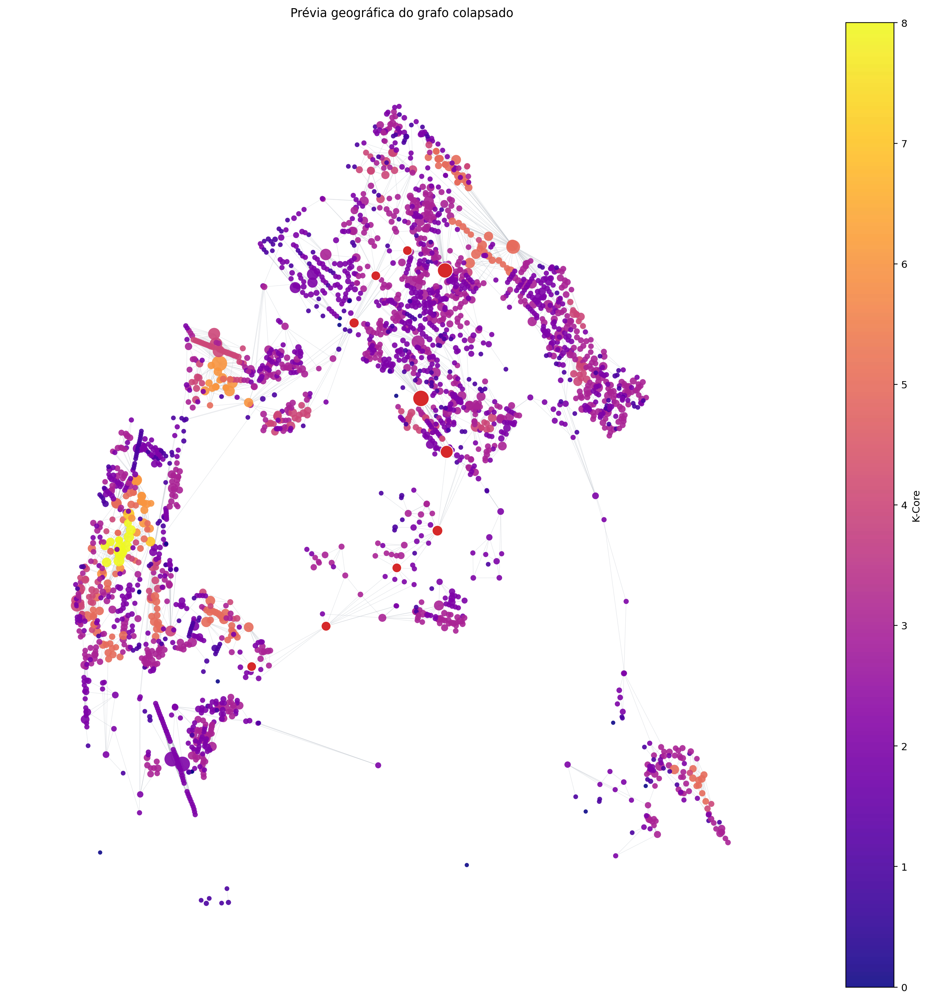
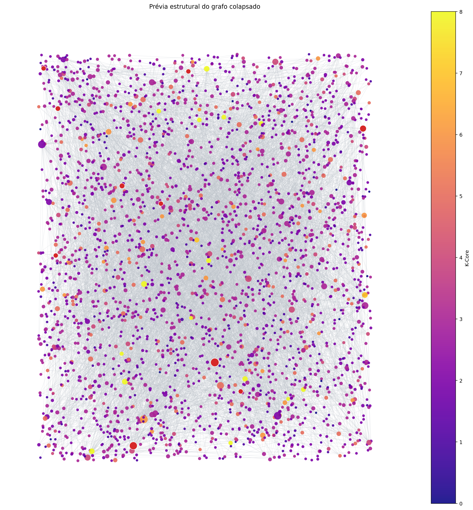
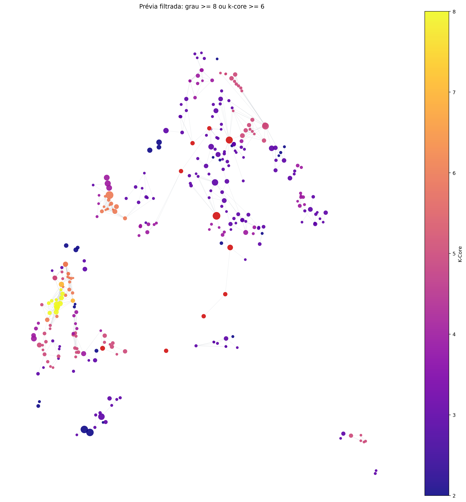

# Por que todo mundo odeia o M34?
**Uma análise estrutural do estrangulamento viário do eixo BR-101 usando Teoria dos Grafos, OSMnx, NetworkX e Gephi.**

## 📖 Prólogo: A anatomia de um engarrafamento diário
Se você estuda na UFRN e mora na região sul da Grande Natal (Parnamirim, Emaús, Nova Parnamirim), você conhece a dor do **M34**. O bloco de aulas que vai das 08h50 às 10h30 exige um deslocamento que coincide com o pior momento da mobilidade urbana potiguar. 

Todos os dias, a viagem de ônibus entre Parnamirim e o Campus Universitário colapsa em um trecho muito específico: a BR-101, entre a Leroy Merlin e o complexo viário de Ponta Negra. O trânsito para, o tempo passa e a primeira aula é perdida. 

Mas por que esse engarrafamento é tão crônico? É apenas excesso de carros, ou existe uma falha fundamental na forma como as ruas da nossa cidade estão conectadas? 

Este projeto nasceu dessa frustração diária. Usando dados reais do OpenStreetMap e métricas de grafos, decidimos modelar a malha viária como uma rede matemática para responder a uma pergunta simples: **o quão dependente e vulnerável é a estrutura da nossa cidade?**

---

## 👥 Equipe e suas atribuição
- Gabriel Sebastião do Nascimento Neto - Elaboração da problematica, juntamente com o levantamento dos dados e start do projeto.
- Ícaro Bruno Silbe Cortês - Exploração e ánalise da viabilidade dos dados, juntamente com a estrategia de colapso dos nós; Inicio da plotagem dos grafos.
- Sara Gabrielly do Nascimento Silva - Implementação dos grafos e ánalise dos resultados.

**Disciplina:** Estrutura de Dados II (DCA3702)

## 📍 Identificação da Região Analisada
- **Região:** corredor de mobilidade sul-norte entre o centro de Parnamirim, Nova Parnamirim, Ponta Negra e o entorno da UFRN.
- **Foco estrutural:** BR-101, Viaduto de Ponta Negra e os principais eixos alimentadores da zona sul.
- **Justificativa:** esse recorte é suficiente para capturar o deslocamento diário de áreas residenciais densas até os polos universitários e comerciais de Natal. Ao mesmo tempo, ele evita uma área grande demais e preserva justamente o conjunto de avenidas onde a dependência da BR-101 se torna mais visível.

## 🎥 Apresentação do Projeto

*(Duração: ~15 minutos. Apresentação da extração, métricas, visualizações no Gephi e conclusões).*

---

## 🎯 Objetivo do Trabalho
O objetivo é analisar a topologia da rede viária da região sul de Natal e Parnamirim para verificar, com métricas de grafos, se o sistema depende de poucas vias estruturais para conectar áreas residenciais, corredores comerciais e o acesso à UFRN. Em especial, buscamos mostrar como a centralidade de intermediação evidencia gargalos e ausência de rotas equivalentes no eixo da BR-101 e de seus acessos.

## 🛠️ Metodologia
- **Extração dos dados:** usamos o `OSMnx` com `network_type="drive"` para baixar a rede viária da área delimitada por um polígono cobrindo Parnamirim, Nova Parnamirim, Ponta Negra e Lagoa Nova.
- **Colapso por nome de via:** além do grafo bruto, utilizamos um grafo colapsado por ruas conectadas com o mesmo nome, o que torna a interpretação urbana mais natural no relatório e no Gephi.
- **Processamento topológico:** com `NetworkX`, convertemos o grafo para uma forma não direcionada e calculamos `degree`, `betweenness centrality`, `closeness centrality` e `core number`.
- **Exportação:** o arquivo final para visualização foi exportado como [br101_colapsados_analise.graphml](data/br101_colapsados_analise.graphml), com os atributos `degree`, `betweenness`, `closeness`, `kcore`, `x` e `y`.
- **Visualização:** o arquivo `.graphml` foi preparado para importação no Gephi, permitindo tanto o layout geográfico via `Geo Layout` quanto a leitura estrutural via `ForceAtlas2`.
- **Ambiente:** instruções de execução estão em [CONTRIBUTING.md](CONTRIBUTING.md). Para reproduzir a exportação auxiliar sem mexer no notebook, usamos `uv run python scripts/generate_collapsed_graph.py`.

## 📊 Métricas Calculadas
- **Grau (`degree`):** mede quantas conexões cada rua agregada possui. No contexto urbano, indica hubs locais e pontos com muitas ligações.
- **Centralidade de intermediação (`betweenness`):** mede quantos caminhos mínimos passam por uma via. Aqui ela funciona como a melhor pista para identificar gargalos, porque mostra de quais avenidas a circulação mais depende.
- **Centralidade de proximidade (`closeness`):** mede o quão perto uma via está, em média, do restante da rede. Ruas com alto closeness tendem a estar em posições centrais para acessar várias partes do recorte.
- **Core number (`k-core`):** mostra o nível de inserção de cada rua em um núcleo densamente conectado. Em vez de apontar apenas eixos de passagem, essa métrica ajuda a destacar miolos urbanos mais estruturados.
- **Nós:** 2624 ruas/segmentos agregados.
- **Arestas:** 5632 conexões entre vias.
- **Grau máximo:** 49.
- **Grau médio:** 4,29.
- **K-core máximo:** 8.
- **Top 10% por grau:** limiar em `degree >= 8`.
- **Filtro recomendado para k-core no Gephi:** `kcore >= 6`, que preserva 50 nós e evidencia a espinha estrutural mais conectada.
- **Top 5 por grau:** Avenida Maria Amélia Machado (49), Rua Campo Azul (45), Rua Campo Alegre (45), Avenida Maria Lacerda Montenegro (41) e Avenida Engenheiro Roberto Freire (38).
- **Top 5 por betweenness:** Avenida Maria Lacerda Montenegro (0,278), Avenida Gandhi (0,258), Avenida Olavo Lacerda Montenegro (0,242), outro segmento da Avenida Olavo Lacerda Montenegro (0,234) e Avenida Pedra d'Água (0,229).
- **Top 5 por closeness:** Avenida Senador Salgado Filho (0,0929), Avenida São Miguel dos Caribés (0,0918), Avenida das Alagoas (0,0908), Avenida Senador Salgado Filho | Avenida das Alagoas (0,0907) e Avenida Abel Cabral (0,0903).
- **Sobreposição entre top 10 de grau e top 10 de betweenness:** apenas Avenida Ayrton Senna e Avenida Maria Lacerda Montenegro aparecem nas duas listas, o que já indica que conexão local e dependência estrutural não são a mesma coisa.

## 🗺️ Principais Visualizações no Gephi
As três prévias abaixo foram geradas em Python apenas para conferir se o `.graphml` exportado está coerente. As capturas oficiais da entrega devem ser reproduzidas no Gephi com a mesma codificação visual descrita em cada item.

### 1. Visualização geográfica
- **Layout:** `Geo Layout`
- **Longitude:** `x`
- **Latitude:** `y`
- **Tamanho do nó:** proporcional a `degree`
- **Cor do nó:** proporcional a `kcore`
- **Destaque:** colorir os maiores valores de `betweenness`

> **Leitura esperada:** nessa vista, o mapa preserva a posição real das vias e permite enxergar onde o corredor da BR-101 e os acessos da zona sul concentram a dependência da rede.

### 2. Visualização estrutural
- **Layout:** `ForceAtlas2`
- **Tamanho do nó:** proporcional a `degree`
- **Cor do nó:** proporcional a `kcore`
- **Destaque:** os maiores valores de `betweenness` devem aparecer como eixos de passagem obrigatória

> **Leitura esperada:** ao abandonar a geografia e olhar apenas a conectividade, a rede tende a se comprimir em torno de poucos corredores fortes, deixando visível a concentração estrutural da mobilidade.

### 3. Filtro obrigatório
- **Opção 1:** filtrar `degree >= 8` para capturar o top 10% dos hubs
- **Opção 2:** filtrar `kcore >= 6` para isolar o núcleo mais denso da rede
- **Recomendação deste trabalho:** usar `kcore >= 6` como filtro principal e, se houver tempo, comparar com `degree >= 8`

> **Leitura esperada:** após o filtro, devem restar principalmente os eixos que distribuem fluxo entre bairros densos e vias arteriais, reduzindo bastante o ruído dos segmentos periféricos.

## ❓ Respostas às Questões Obrigatórias

**1. Os nós com maior grau coincidem com os nós de maior betweenness?**  
Não totalmente. Há alguma interseção, mas ela é pequena: entre os top 10 por grau e os top 10 por betweenness, apenas a Avenida Ayrton Senna e a Avenida Maria Lacerda Montenegro aparecem nas duas listas. Isso mostra que ruas muito conectadas localmente nem sempre são as mais importantes para o fluxo global da rede.

**2. O núcleo identificado pelo k-core coincide com os principais hubs?**  
Só em parte. O `k-core` mais alto indica um núcleo estruturalmente denso, enquanto o grau destaca ruas com muitas conexões diretas. Os hubs ajudam a compor esse núcleo, mas a decomposição em `k-core` revela principalmente a região onde a conectividade é mais robusta e não apenas onde existe maior número de ramificações.

**3. O que a métrica de betweenness revela que o grau não revela?**  
O grau informa quantas conexões uma rua possui, mas não diz se ela é necessária para costurar diferentes partes da cidade. Já a betweenness mostra dependência de passagem: quando avenidas como Maria Lacerda Montenegro, Gandhi, Olavo Lacerda Montenegro, Dão Silveira e Senador Salgado Filho aparecem com valores altos, isso indica que muitos caminhos mínimos passam por elas. Em termos de mobilidade, isso significa menos rotas alternativas eficientes e maior chance de gargalo.

**4. O que muda quando a rede é analisada em sua posição geográfica real e quando é analisada por um layout estrutural?**  
No layout geográfico, vemos exatamente onde o problema acontece: o corredor da BR-101 e seus acessos aparecem encaixados na malha real da cidade. No layout estrutural, a leitura muda de "onde está" para "como funciona": a rede se reorganiza em torno de poucos eixos dominantes, deixando mais claro que a mobilidade depende de uma espinha dorsal com capacidade limitada de desvio.

**5. Existem regiões críticas para mobilidade urbana na área analisada?**  
Sim. As métricas apontam como áreas críticas o eixo formado por Avenida Senador Salgado Filho, Avenida Engenheiro Roberto Freire, Avenida Maria Lacerda Montenegro, Avenida Ayrton Senna, Avenida Gandhi, Avenida Olavo Lacerda Montenegro e demais acessos que convergem para o corredor principal da BR-101 e para o entorno de Ponta Negra. São justamente os trechos mais sensíveis para conectar áreas residenciais da zona sul ao restante da cidade.

**6. A rede parece homogênea ou apresenta concentração estrutural?**  
A rede não é homogênea. Os resultados mostram concentração estrutural: o grau médio é 4,29, mas poucas vias concentram os valores mais altos de grau, closeness e principalmente betweenness. Além disso, o `k-core` máximo é 8 e apenas 50 nós permanecem no filtro `kcore >= 6`, o que reforça a ideia de que a espinha principal da mobilidade está concentrada em um subconjunto pequeno da rede.

**7. Os resultados obtidos fazem sentido considerando o conhecimento urbano da região escolhida?**  
Sim. Eles dialogam diretamente com a experiência cotidiana do trajeto Parnamirim -> UFRN. As avenidas que aparecem como mais centrais e mais intermediadoras são justamente aquelas conhecidas por concentrar fluxo, filas e retenções no deslocamento da manhã. Em outras palavras, o grafo não apenas representa a cidade: ele confirma matematicamente a sensação urbana de que a zona sul depende de poucos corredores para chegar ao campus e aos bairros centrais.

## 🏁 Principais Conclusões
O grafo colapsado mostra que a lentidão do eixo do M34 não é só um problema de volume de veículos, mas também de estrutura. A malha viária analisada apresenta forte concentração em poucos corredores, e as métricas de betweenness indicam que várias avenidas funcionam como passagens quase obrigatórias entre áreas residenciais densas e os polos de destino.

Isso ajuda a explicar por que pequenos bloqueios ou excesso de demanda nesses eixos causam efeitos desproporcionais em todo o deslocamento. O mapa geográfico mostra onde o gargalo acontece; o layout estrutural mostra por que ele é tão difícil de contornar.
